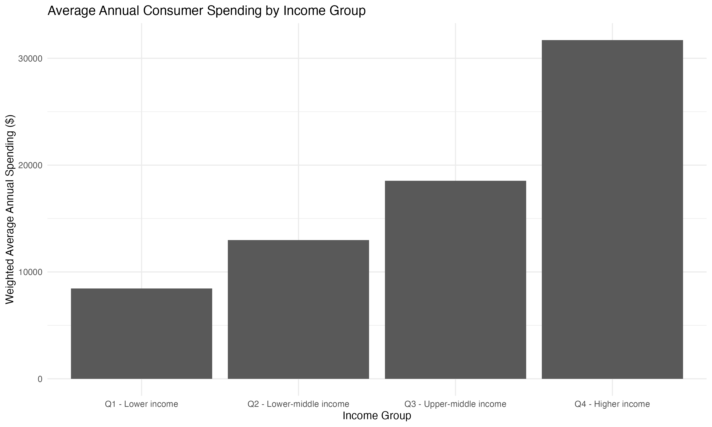
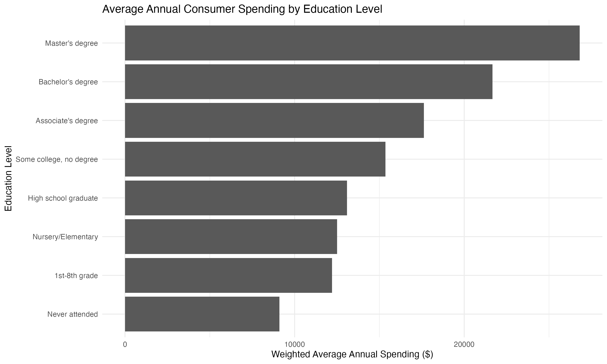

# U.S. Consumer Spending & Marketing Analytics

## Project Overview

This project analyzes U.S. consumer spending patterns using the Bureau of Labor Statistics (BLS) Consumer Expenditure Survey Public Use Microdata.

The analysis examines how annual consumer spending varies across income and education groups. The goal is to identify meaningful consumer segments and translate spending patterns into actionable marketing and business insights.

## Business Questions

- How does annual consumer spending differ across income groups?
- How does consumer spending vary by education level?
- What is the spending gap between the highest- and lowest-income groups?
- What is the spending gap between the highest- and lowest-spending education groups?
- What consumer segmentation insights can support marketing strategy?

## Data Source

**Bureau of Labor Statistics (BLS) — Consumer Expenditure Survey Public Use Microdata**

The analysis uses the 2024 Consumer Expenditure Interview Survey files, including the quarterly files required to construct a calendar-year analysis.

The project uses publicly available government data and does not include personally identifiable information.

## Tools & Technologies

- R
- RStudio
- dplyr
- ggplot2
- Microsoft Excel
- BLS Consumer Expenditure Survey Public Use Microdata

## Analysis Process

### 1. Data Preparation

- Imported the BLS Consumer Expenditure Survey files into R.
- Combined five quarterly Interview Survey files covering the 2024 calendar-year expenditure reporting period.
- Standardized variable formats across files.
- Converted expenditure and income variables to numeric formats.
- Created calendar-year expenditure measures.
- Applied BLS annual population-weight adjustments using the representative survey weights and month-in-scope methodology.

### 2. Consumer Segmentation

Income groups were created using income quartiles:

- Q1 — Lower income
- Q2 — Lower-middle income
- Q3 — Upper-middle income
- Q4 — Higher income

Education categories were created using the BLS education reference variable.

### 3. Weighted Analysis

Weighted average annual expenditures were calculated using the adjusted annual population weights.

## Key Findings

### Overall Spending

The overall BLS-adjusted weighted average annual consumer expenditure in this analysis was approximately:

**$18,204**

### Income Segmentation

| Income Group | Weighted Average Annual Spending |
|---|---:|
| Q1 — Lower income | $8,454 |
| Q2 — Lower-middle income | $12,995 |
| Q3 — Upper-middle income | $18,529 |
| Q4 — Higher income | $31,700 |

The highest-income group spent approximately **3.75 times** as much as the lowest-income group.

The difference represents an estimated **274.97% spending premium** relative to the lowest-income group.

### Education Segmentation

| Education Level | Weighted Average Annual Spending |
|---|---:|
| Never attended | $9,104 |
| 1st–8th grade | $12,210 |
| Nursery/Elementary | $12,502 |
| High school graduate | $13,093 |
| Some college, no degree | $15,361 |
| Associate's degree | $17,627 |
| Bachelor's degree | $21,661 |
| Master's degree | $26,805 |

The highest-spending education group in this analysis was the **Master's degree** group, while the lowest was **Never attended**.

The spending difference between these groups was approximately **$17,700.85**, representing a **194.42% spending premium** relative to the lowest-spending group.

## Marketing & Business Insights

### 1. Income is a strong segmentation variable

The substantial spending difference across income groups demonstrates the importance of purchasing power when developing customer segments.

Higher-income consumers represent a segment with substantially greater average spending capacity, which can influence pricing, product positioning, premium offerings, and targeted marketing strategies.

### 2. Education is associated with differences in spending

Spending generally increased across higher education levels in this analysis. This provides another potential segmentation dimension for understanding consumer behavior.

### 3. Segmentation can support differentiated marketing

Combining demographic characteristics such as income and education can help organizations develop more targeted marketing strategies rather than relying on a single broad consumer profile.

## Visualizations

### Spending by Income Group



### Spending by Education Level



## Project Structure

```text
consumer_spending_analysis/
│
├── consumer_spending_analysis.R
├── README.md
│
├── data/
│
└── visualizations/
    ├── income_spending_chart.png
    └── education_spending_chart.png